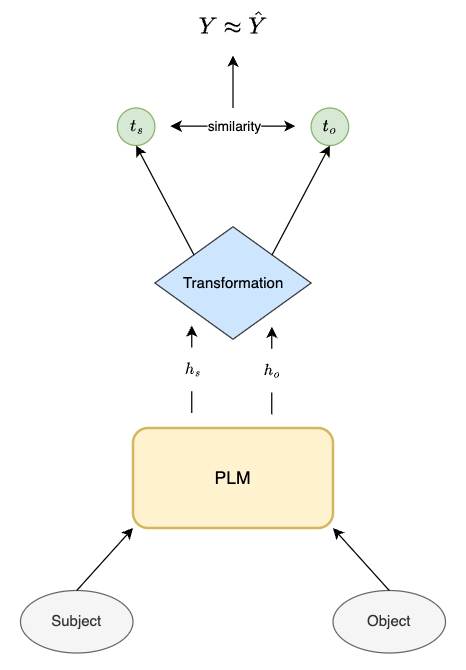

## Factual Probe

An innovative method that uses probing to unveil implicit factual knowledge present in Pre-trained Language Models (PLMs) representation space.

### Method

A dataset consisting of knowledge graph triples and a similarity score between the subject and object pairs is collected. The dataset is constructed from the Wikidata knowledge graph using the [Wikidata5m dataset](https://deepgraphlearning.github.io/project/wikidata5m).

Subjects and objects from the knowledge graph are inserted into a PLM to extract contextual embeddings out of them. The contextual embeddings $\mathbf{h}_s$ and $\mathbf{h}_o$ undergo a transformation by an additional model, which outputs transformed embeddings $\mathbf{t}_s$ and $\mathbf{t}_o$. A similarity score $Y$ between the transformed vectors is then computed and compared to the true similarity scores $\hat{Y}$ present in the dataset. The hypothesis is that factual knowledge is embedded in the language model if the linear transformation is able to reproduce the similarity scores of the knowledge graph embeddings using only the contextual embeddings.



The full methodology can be found in this [master's thesis](https://utheses.univie.ac.at/detail/72334/) or in this [research paper](https://ebooks.iospress.nl/DOI/10.3233/FAIA250204) of Munda at al. (2025). For citations please use the following:

```bibtex
@incollection{munda2025vector,
  title={Vector Space Transformations to Uncover Knowledge Graphs in Neural Language Models},
  author={Munda, Giacomo and Gromann, Dagmar and Heinzle, Tobias},
  booktitle={Handbook on Neurosymbolic AI and Knowledge Graphs},
  pages={121--145},
  year={2025},
  publisher={IOS Press}
}
```


### How to run

**Training**

- Run ```train.py``` under `factual-probe/src`. This will trigger the training of the probe on the Wikidata dataset (contact the owner of this repository for access to the data). It will also save the trained probe in the selected folder. The hyperparameters can be configured in ```config.py```.

- If you wish to train the linear probe with different dimensionalities, you can do so by running ```train_dimensionality_reduction.py```.

The different embedding strategies, as well as the different probing models can be found in ```embeddings.py``` and ```transformations.py``` respectively.

**Evaluation**

- ```evaluate.py``` evaluates the probe on the test data in a quantitative way.
- ```evaluate_qualitative.py``` performs the qualitative evaluation.
- ```spectrum.py``` computes and plots the spectrum of the probe (transformation matrix).